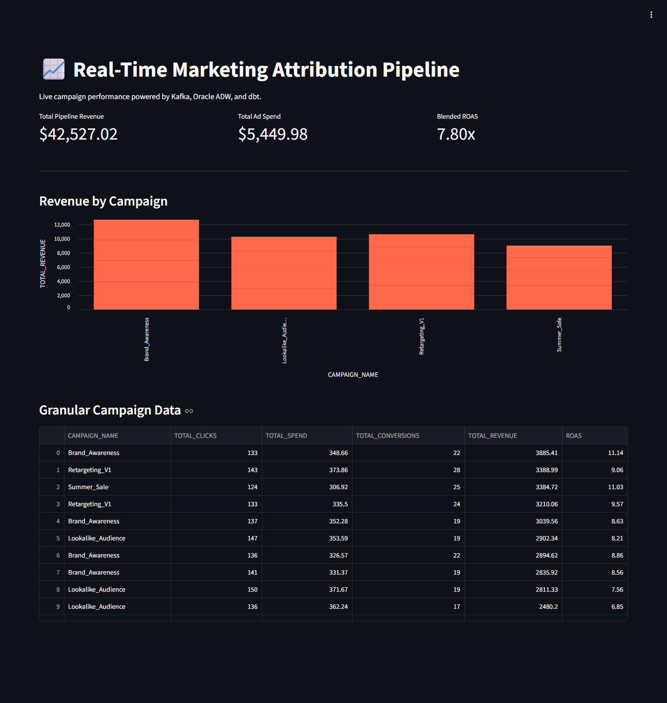
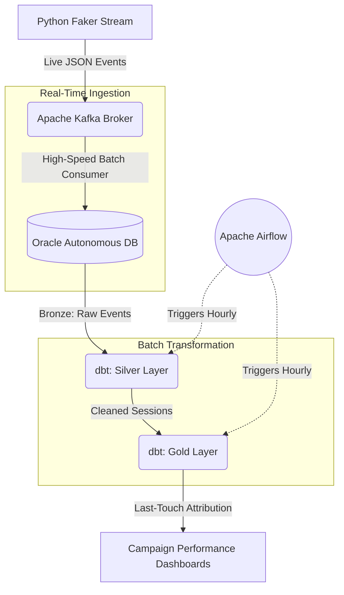

# 📈 Real-Time Marketing Attribution Pipeline

## 📌 Project Overview
An enterprise-grade, automated ELT (Extract, Load, Transform) data pipeline designed to solve a complex business problem: **Marketing Attribution**. 

This system ingests high-velocity, simulated internet traffic (ad clicks and purchases), buffers it through an Apache Kafka event bus, securely loads it into an Oracle Autonomous Data Warehouse, and uses dbt (Data Build Tool) orchestrated by Apache Airflow to calculate the exact Return on Ad Spend (ROAS) for every marketing campaign using a Last-Touch Attribution model.

**Business Value:** Demonstrates the ability to handle continuous streaming data, enforce strict relational state, securely transform nested payloads, and maintain zero-downtime automated infrastructure.

---

## 🏗️ System Architecture

## 🛠️ The Tech Stack

* **Data Generation:** Python (`Faker`) simulating a high-volume, stateful user journey.
* **Event Bus:** Zookeeper-less (KRaft) **Apache Kafka** deployed via Docker.
* **Data Warehouse:** **Oracle Autonomous Data Warehouse (ADW)** secured via strict Mutual TLS (mTLS) cryptographic wallet authentication.
* **Transformation (ELT):** **dbt (Data Build Tool)** pushing heavy SQL window functions down to the Oracle compute engine.
* **Orchestration:** **Apache Airflow** configured with a custom DAG for hourly, autonomous robotic execution.

---

## 🚀 How It Works Under the Hood

1. **The Mock Stream (`mock_streams.py`):** Continuously generates synthetic user journeys. Crucially, it maintains an active memory pool to ensure a "conversion" is mathematically tied to a pre-existing "ad click".
2. **The Ingestion Engine (`consumer.py`):** Subscribes to the Kafka topics and performs rapid `executemany()` batch inserts into the Bronze layer of the Oracle Database.
3. **The Analytics Engine (`dbt`):** Uses SQL window functions (`ROW_NUMBER()`) to map a user's final purchase back to the *last specific ad* they clicked before buying, eliminating duplicate revenue reporting.
4. **The Automation (`Airflow`):** Wakes up every hour, crosses virtual environments securely, and triggers the dbt transformations without human intervention.

---

*Note: Due to security best practices, cryptographic wallets and environment variables have been excluded from this repository.*
